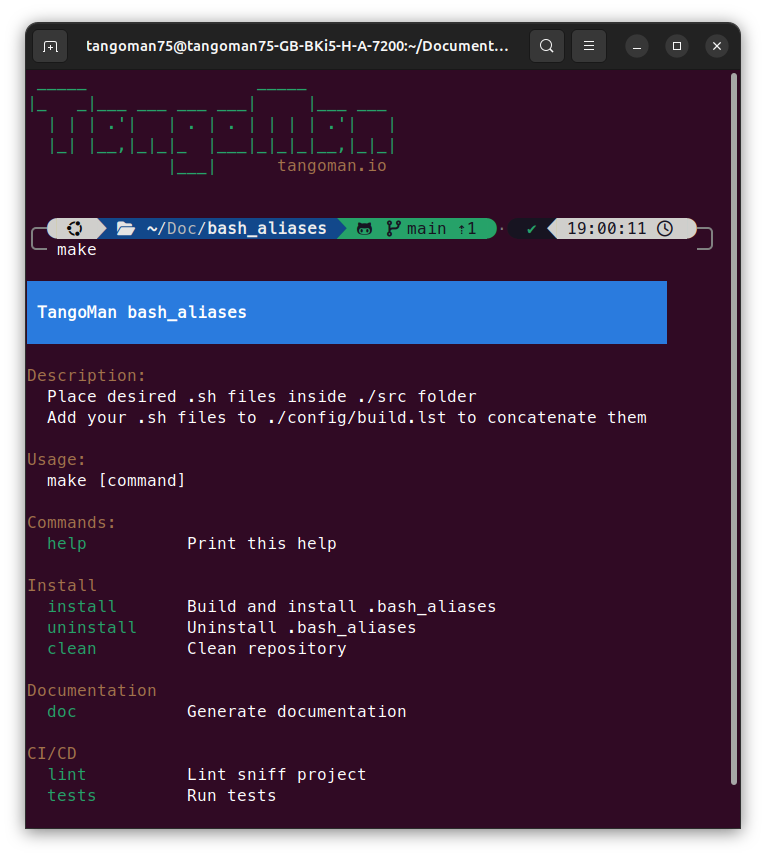

[](https://github.com/TangoMan75/bash_aliases/releases)


TangoMan Bash Aliases
=====================

**TangoMan Bash Aliases** is a fantastic collection of utterly handful scripts for your terminal !!!
**TangoMan Bash Aliases** is compatible with _Windows CygWin_ _MacOsX_ or _Linux / Ubuntu_ terminals plus _bash_ AND _zsh_ shells WOW !!!



📑 Documentation
----------------

Documentation available here: [./docs/bash_aliases.md](./docs/bash_aliases.md)

🚀 Installation
---------------

Execute following command in your terminal

### With wget
> jsDelivr
```bash
wget -nc -q https://cdn.jsdelivr.net/gh/TangoMan75/bash_aliases/install.sh && sh install.sh install
```
> raw.githubusercontent.com
```bash
wget -nc -q https://raw.githubusercontent.com/TangoMan75/bash_aliases/master/install.sh && sh install.sh install
```

### With cURL
if you have `curl` installed:
> jsDelivr
```bash
curl -SsL https://cdn.jsdelivr.net/gh/TangoMan75/bash_aliases/install.sh -o install.sh  && sh install.sh install
```
> raw.githubusercontent.com
```bash
curl -SsL https://raw.githubusercontent.com/TangoMan75/bash_aliases/master/install.sh -o install.sh  && sh install.sh install
```

🤖 Commands
-----------

Install **TangoMan Bash Aliases** and **"Oh-My-ZSH"**
```bash
make install
```

Install **TangoMan Bash Aliases** only
```bash
make min-install
```

Install **"Oh-My-ZSH"** only
```bash
make install-zsh
```

💻 Dependencies
---------------

### 🔖 git

#### 🐧 Install git (Linux)

```bash
$ sudo apt-get install --assume-yes git
```

#### 🏁 Install git (Windows)

Download and install latest version from here [git-scm.com](https://git-scm.com/download/win)

#### 🍎 Install git (OSX)

```bash
$ brew install git
```

#### 🔧 git configuration

Push current branch only if upstream exists

```bash
$ git config --global push.default simple
```

Set vim as git default editor

```bash
$ git config --global core.editor 'vim'
```

### ⚡ Initialize git submodules

In order to download project submodules, enter the following command

```bash
$ git submodule update --init --recursive
```

---

### 🛠 Make

#### 🐧 Install Make (Linux)

On linux machine enter following command

```bash
$ sudo apt-get install --assume-yes make
```

#### 🏁 Install Make (Windows)

On windows machine you will need to install [cygwin](http://www.cygwin.com/) or [GnuWin make](http://gnuwin32.sourceforge.net/packages/make.htm) first to execute make script.

#### 🍎 Install Make (OSX)

Make should be available by default on OSX system, but you can upgrade make version with following command

```bash
$ brew install make
```

---

💄 Theme
--------

tangoman.zsh-theme is actually personal adaptation of [agnoster-zsh-theme](https://github.com/agnoster/agnoster-zsh-theme) which I love.

🤝 Contributing
---------------

Thank you for your interest in contributing to **TangoMan Bash Aliases**.

Please review the [code of conduct](./CODE_OF_CONDUCT.md) and [contribution guidelines](./CONTRIBUTING.md) before starting to work on any features.

If you want to open an issue, please check first if it was not [reported already](https://github.com/TangoMan75/bash_aliases/issues) before creating a new one.

📜 License
----------

Copyrights (c) 2025 &quot;Matthias Morin&quot; &lt;mat@tangoman.io&gt;

[](LICENSE)
Distributed under the MIT license.

If you like **TangoMan Bash Aliases** please star, follow or tweet:

[](https://github.com/TangoMan75/bash_aliases/stargazers)
[](https://github.com/TangoMan75)
[](https://twitter.com/intent/tweet?text=Wow:&url=https%3A%2F%2Fgithub.com%2FTangoMan75%2Fbash_aliases)

... And check my other cool projects.

[](https://www.linkedin.com/in/morinmatthias)

🙏 Acknowledgements
-------------------

* [bash_unit](https://github.com/pgrange/bash_unit): bash unit testing enterprise edition framework (used for CI/CD)
* [shellcheck](https://github.com/koalaman/shellcheck): a static analysis tool for shell scripts (used for CI/CD)
* [bashew](https://github.com/pforret/bashew): from which I copied some of the CI/CD configuration
* Documentation from [Google](https://google.github.io/styleguide/shellguide.html), [BashPitfalls](https://mywiki.wooledge.org/BashPitfalls), [Microsoft](https://github.com/microsoft/code-with-engineering-playbook/blob/master/code-reviews/recipes/Bash.md)

Script created with [makefile-generator](https://github.com/TangoMan75/makefile-generator)
